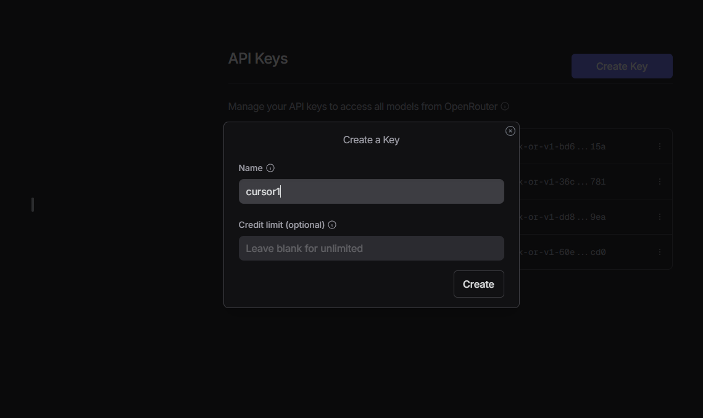

<h1 align="center" id="title">Open-Cursor</h1>

<p align="center">
<p></p>


# 💻 Free AI Chat in Cursor IDE Using OpenRouter

This is a guide for y'all that want to use that AI chat feature in IDE's like **Cursor** and **Windsurf** without breaking the bank and having a limited amount of prompts from premium models that spit out the same outputs as free-models.

I will be using ai to grammatically clean up the steps below so you can read what I type out coherently
---

## 🔧 Prerequisites

- Install [Cursor IDE](https://www.cursor.so/) on your device.
  - **Do not** pay for the subscription.
  - **Do not** start the free trial — just use the free tier.

- Sign up at [OpenRouter.ai](https://openrouter.ai).
  - **Do not** top up your account unless you want to try premium models like OpenAI’s o1 or Claude Sonnet 3.7.

---

## 🚀 Setup Instructions

1. Open Cursor and go to:
   - `Cursor Settings > Models`
  

2. Scroll to the **OpenAI API Key** section. 


3. In a separate tab, go to [OpenRouter.ai](https://openrouter.ai).

4. Hover over the dropdown in the top-right and select **Keys**.


5. Create a new API key:
   - Name it anything you want.
   - Leave the credit limit **blank** (we're not spending money).



6. Copy the API key. {Store anywhere you want fam, or maybe practice them security habits}


7. Back in Cursor:
   - Paste your API key into the **OpenAI API Key** field.
   - For the **Base URL**, use:

     ```
     https://openrouter.ai/api/v1
     ```


8. Click verify — this should only take a few seconds. {if it doesn't work and u typed in your key, check your spelling! }

---

## 🤖 Choosing Free Models [The Fun Part]

1. On OpenRouter, go to the **Models** tab.


2. On the sidebar, adjust the **Prompt Pricing** slider to `FREE`.

3. Choose any model you like. In this case for various reasons we're choosing Deepseek r1(free) *cough*, *cough*:  
   Type in and press on **deepseek r1 free**


5. Copy the model code. [Below the Title DeepSeek: R1 (free)]

6. Back in Cursor:
   - Click **Add Model**.
   - Paste the model code into the name field.


7. **Bonus feature** Repeat to add as many free models as you want.

**Models I use and reccommend**

The Free ones hahahahaha... **moving on!**

---

## 💡 NOW Test the Setup!!!

1. Create a folder called **Code** and in it a simple Python file (e.g., `hello.py`) in Cursor. [I'll assume you know how to create a .py file in a IDE]

2. Click the Right-Side panel icon and then the AI chat icon (top-right of the Cursor IDE).

3. Select the model in the prompt input box(e.g., `deepseek/deepseek-r1:free`).

4. Ask:

   ```plaintext
   How do I print "Hello World" in Python?
   ```
   **It will take a second as R1 is a reasoning model**
   
6. Now lets break it, remove a quotation mark from the end of hello world.

7. Ask your ai chhat, `why is my code not working?`

8. It should tell you about a syntax error due to an unclosed string literal **you didn't close the quote**

# In conclusion:

Thats it, now you can "VIBE-CODE" without having to swap back and forth between your IDE and Openai to code your **tech startup**
Just kidding unless you did do that... anyway this should work fine and If you any better way of doing this please pull request if u wanna help make this more efficent and accuarate and stuff.
